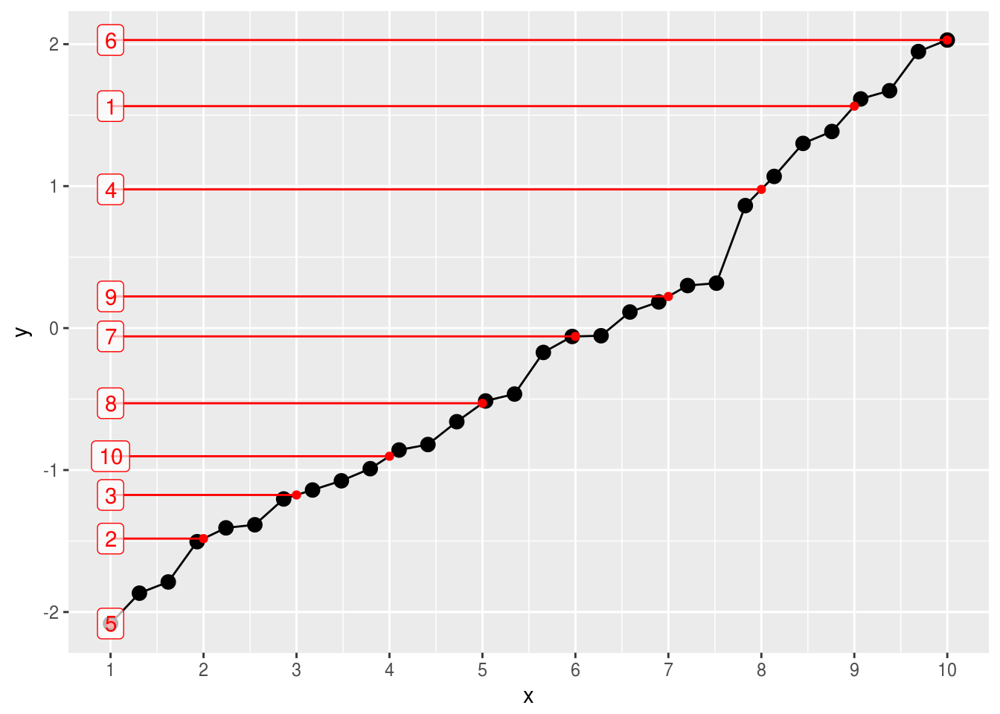

<!-- README.md is generated from README.Rmd. Please edit that file -->
histmatch [](https://travis-ci.org/krlmlr/histmatch)
=======================================================================================================================================

Provides a fast implementation for weighted [histogram matching](https://en.wikipedia.org/wiki/Histogram_matching).

``` r
histmatch(1:10, 1:10)
#>  [1]  1  2  3  4  5  6  7  8  9 10
histmatch(1:10, 2:11)
#>  [1]  2  3  4  5  6  7  8  9 10 11
histmatch(1:11, 5:6)
#>  [1] 5.0 5.1 5.2 5.3 5.4 5.5 5.6 5.7 5.8 5.9 6.0
histmatch(1:11, c(2, 4, 5))
#>  [1] 2.0 2.4 2.8 3.2 3.6 4.0 4.2 4.4 4.6 4.8 5.0
```

In the following plot, the black and red elements correspond to the target and source distribution, respectively.

``` r
set.seed(20161031)
x_source <- runif(10)
x_source
#>  [1] 0.78 0.24 0.36 0.75 0.02 1.00 0.74 0.58 0.75 0.49
x_target <- rnorm(30)
x_target
#>  [1] -0.659  1.385  1.301 -0.513  1.672 -1.504 -0.059  1.948 -1.788 -0.464  1.614 -0.820 -2.081
#> [14]  2.029 -0.054 -0.990 -1.385  1.069 -0.859  0.184  0.317 -1.867 -1.407  0.113 -1.203  0.300
#> [27] -1.140 -1.075 -0.171  0.863
histmatch_data(x_source, x_target) %>% plot
```



Timing
------

For random vectors, which are generated using the following function:

``` r
r <- function(e) runif(10 ** e)
```

    #> # A tibble: 9 × 2
    #>                          expr median_ms
    #>                        <fctr>     <dbl>
    #> 1                        r(4)      0.32
    #> 2       histmatch(r(3), r(3))      0.77
    #> 3 histmatch(r(3), r(3), r(3))      0.82
    #> 4       histmatch(r(3), r(4))      1.75
    #> 5 histmatch(r(3), r(4), r(4))      2.15
    #> 6       histmatch(r(4), r(4))      3.44
    #> 7 histmatch(r(4), r(4), r(4))      3.85
    #> 8       histmatch(r(4), r(3))      2.27
    #> 9 histmatch(r(4), r(3), r(3))      2.33

Installation
------------

``` r
devtools::install_github("krlmlr/histmatch")
```
